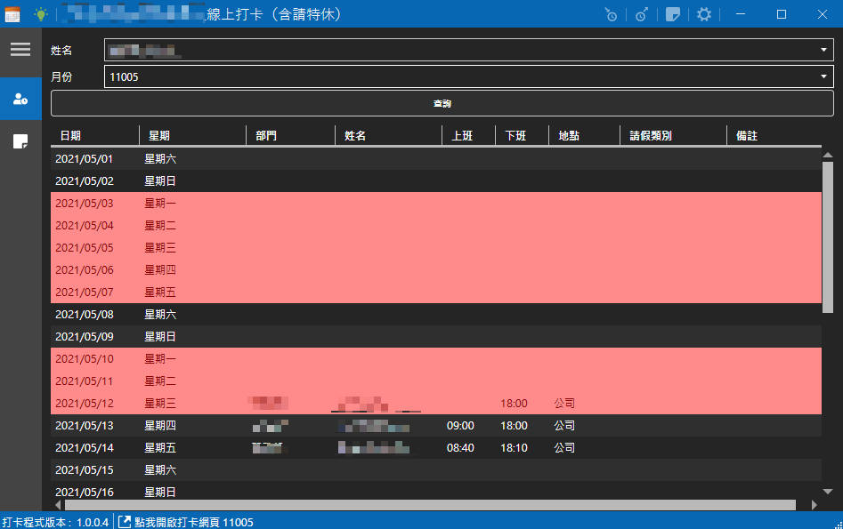
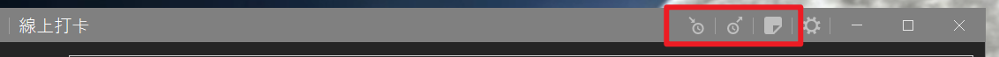
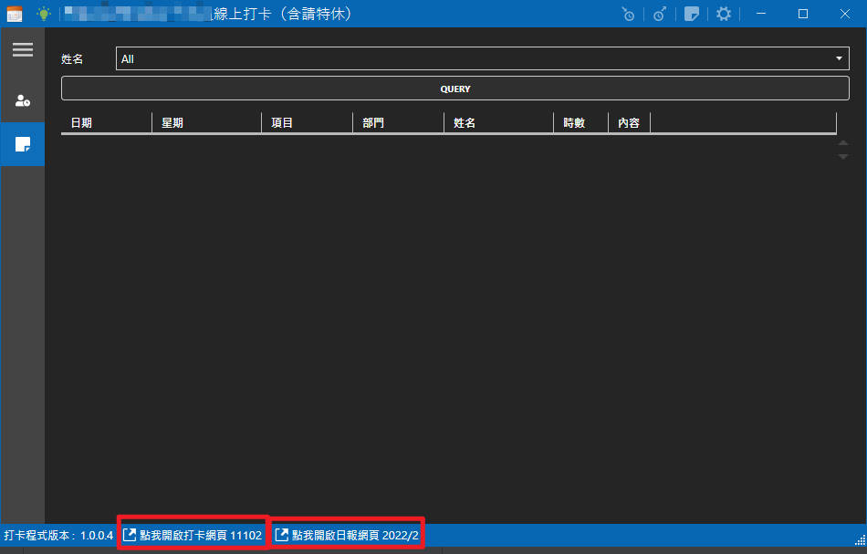
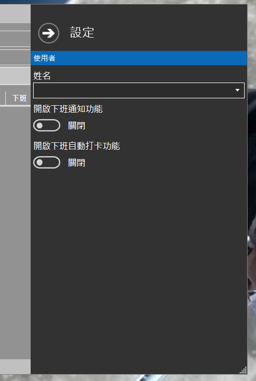
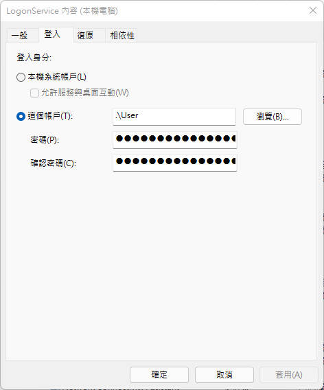

# 打卡幫手
## 開發緣由
三級警戒爆發令許多人措手不及，隨著WFH帶來線上打卡的需求，臨時解決之道就先使用Google Sheet來做工具，  

但每天打開Google表單往下滑尋找空位填資料，有時候下班忘記填寫時間，到了月底就要開始花時間在所有人的打卡記錄裡，檢查有自己沒有忘打卡，變成很不方便的一件事，  

## 需求的演進
> 統計哪一天忘打卡 => 可以利用軟體打上下班卡 => 下班時間提醒 => 可以寫日報 => 瀏覽一週日報

> 偵測電腦使用者登入自動打卡 => 超過下班時間太久自動打下班卡

## 功能介紹
1. 打卡記錄瀏覽
    * 沒打到卡的 標示紅色提醒
   
        
     
    * 下班前 30, 5 分鐘提醒
   
        
   
        

2. 日報瀏覽

3. 程式內進行上班、下班打卡，和日報填寫

   

4. 日報、打卡網址連結
   > 由於打卡助手無法修改打卡時間與日報內容，所以軟件下方提供Sheet連結，方便手動上去修改
   

5. 配合另一隻Windows服務，偵測到使用者登入，打API給打卡程式，自動化上班打卡
   > 由外部實作打卡偵測方式，目前提供Windows使用者登入偵測，也可以開發打卡按鈕與IO卡偵測，最後打API給打卡軟件，由打卡軟件判斷是否需要打卡

6. 下班忘打卡時，自動補打
    > 下班時間超過一定時間，自動補打下班卡

7. 功能設定
   * 使用者設定
   * 開關下班通知功能
   * 開關下班自動打卡功能
   
     

## 運用技術
   * 使用`Google Sheet API`讀寫表格
   * 使用`行政院國定假日csv`判斷是否假日
   * 使用`LiteDb`輕量級NoSQL資料庫緩存線上資料
   * 使用`MahApps.Metro`UI控制項
   * 使用`Quartz.Net`做更新與通知排程
   * 使用`ini-parser-netstandard`來取代WinApi讀寫Ini檔案功能
   * 使用`Hardcodet.NotifyIcon.Wpf`來做系統欄通知
   * 使用`Dapplo.Microsoft.Extensions.Hosting.Wpf`來統一`.Net Core泛型主機`程式風格
   * 使用`Autofac`做依賴注入功能
   * 使用`ReactiveUI`做響應式MVVM框架
   * 使用`NLog`做日誌記錄
   * 使用`CommandLineParser`來做LogonService的安裝、移除、執行命令解析

## 程式用途
   * PunchClockIn - 打卡助手 (平常常駐於 Windows 工具列)
   * LogonWorkOnService - 使用者登入偵測 (選配，需註冊成 Windows Service，需要使用使用者帳號登入執行)
     


## 設定檔
設定檔位於`Config.ini`中，必備參數如下
``` ini
[GoogleSheet]
# 申請Google API 的授權
ClientSecretFilePath=<Google Sheet Client Secret>
# 打卡的Sheet Id
PunchSpreadsheetId=<Punch Sheet Id>
# 日報填寫的Sheet Id
DailySpreadsheetId=<Daily Sheet Id>
```

## LogonService 命令
### Help
```
$ LogonService --help
LogonService 1.0.0
Copyright (C) 2022 LogonService

  install      Install Windows Service

  uninstall    Uninstall Windows Service

  service      (Default Verb) Run the Program.

  help         Display more information on a specific command.

  version      Display version information.
```

### 安裝
請使用使用者帳號執行，需要設定`-u <User> -p <Password>`
``` cmd
LogonService install -u ./user -p mypassword
```
```
$ LogonService install --help
LogonService 1.0.0
Copyright (C) 2022 LogonService

  -b, --binPath     Service exe path setting

  -n, --name        Service Name setting

  -u, --user        Service Account Setting

  -p, --password    Service Password Setting

  --help            Display this help screen.

  --version         Display version information.
```

### 移除服務
``` cmd
LogonService uninstall
```

### 執行
``` cmd
LogonService
```